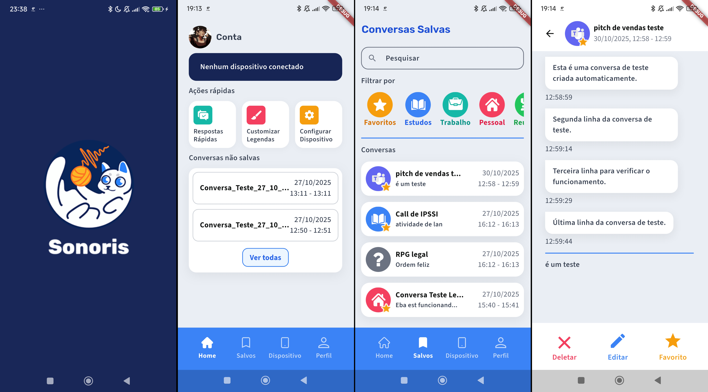

<div align=center>
  


</div>

<b>Sonoris</b> é um projeto, constituido por um aplicativo e um dispositivo, desenvolvido ao longo de 2025 em parceria com uma empresa, como parte do Trabalho de Conclusão de Curso (TCC) do curso de **Desenvolvimento de Sistemas AMS da Etec da Zona Leste**. **[Landing Page da Sonoris](https://sonoris.vercel.app/)**

# Sumário

- [🌟 Sobre a Sonoris](#-sobre-a-sonoris)
- [📖 Funcionalidades do aplicativo](#-funcionalidades-do-aplicativo)
- [💻 Tecnologias Utilizadas](#-tecnologias-utilizadas)
  - [Telas](#telas)
  - [Transcrição](#transcrição)
  - [Servidor BLE](#servidor-ble)
- [🚀 Como rodar o projeto](#-como-rodar-o-projeto)
- [📁 Outros repositórios](#-outros-repositórios)
- [😀 Contribuidores](#-contribuidores)

## 🌟 Sobre a Sonoris

O projeto tem como propósito facilitar a comunicação e promover a inclusão de **pessoas com deficiência auditiva**, principalmente em contextos profissionais e acadêmicos, utilizando transcrição de voz e opções de customização.

<div align=center>
  


</div>

## 📖 Funcionalidades do aplicativo

O aplicativo da Sonoris tem a função de configurar o dispositivo e personalizar a experiencia do usuário, sendo possivel customizar as legendas mostradas no dispositivo, como cores e fontes.

Também é possível revisar as transcrições anteriores, customizando-as em conversas, com opções de filtro e pesquisa.

Por último a opção de respostas rápidas, que toca uma mensagem em Text-to-Speech em voz alta para comunicação com pessoas ao arredor.

## 💻 Tecnologias utilizadas


## 🚀 Como rodar o projeto

```sh
# clone o repositório
git clone https://github.com/Beatriz02020/Sonoris-iot-app-transcricao

# acesse o diretório
cd Sonoris-iot-app-transcricao
```

Configure o Firebase através da CLI

```sh
# Renomeie o .env.example para .env e adicione suas variáveis do Cloudinary
CLOUDINARY_CLOUD_NAME=your_cloud_name
CLOUDINARY_UPLOAD_PRESET=your_upload_preset
CLOUDINARY_API_KEY=your_api_key
CLOUDINARY_API_SECRET=your_api_secret

```

```dart
// instale as dependências do flutter
flutter pub get

// rode o aplicativo
flutter run
```

## 📁 Outros repositórios

- <b> [Dispositivo](https://github.com/Chrb09/Sonoris-Raspberry-Pi) </b><br>
- <b> [Landing Page](https://github.com/Amanda093/Sonoris) </b><br>
- <b> [Documentação](https://github.com/Beatriz02020/Sonoris-iot-app-transcricao/tree/documentation) </b>

## 😀 Contribuidores

<div align=center>
<table>
  <tr>
    <td align="center">
      <a href="https://github.com/Amanda093">
        <br>
        <sub>
          <b>Amanda</b>
        </sub> <br>
      </a>
    </td>
    <td align="center">
      <a href="https://github.com/Beatriz02020">
        <br>
        <sub>
          <b>Beatriz</b>
        </sub> <br>
      </a>
    </td>
    </td>
    <td align="center">
      <a href="https://github.com/Chrb09">
        <br>
        <sub>
            <b>Carlos</b>
          </sub> <br>
      </a>
    </td>
  </tr>
</table>
</div>
<br>
